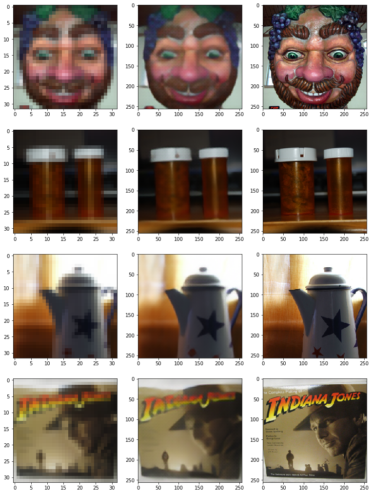
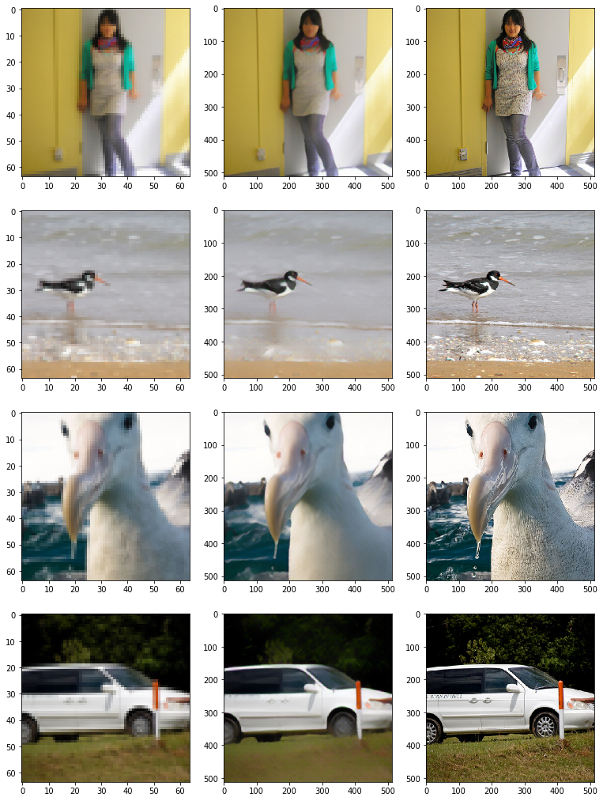

# Super Resolution

This is an implementation of "Super Resolution" image enhancement based roughly on these papers [Enhanced Deep Residual Networks for Single Image Super-Resolution](https://arxiv.org/pdf/1707.02921.pdf),[Deeply-Recursive Convolutional Network for Image Super-Resolution](https://arxiv.org/pdf/1511.04491.pdf)

Tested using a subset of [Image-Net](http://files.fast.ai/data/imagenet-sample-train.tar.gz)

# Code Usage

Usage instructions found here: [user manual page](USAGE.md).

# Example Results
## Image-Net (32x32 > 256x256)
#### (1: Low Res Image  — 2: Generated High Res Image — 3: Real High Res Image)

## Image-Net (64x64 > 512x512)
#### (1: Low Res Image  — 2: Generated High Res Image — 3: Real High Res Image)

