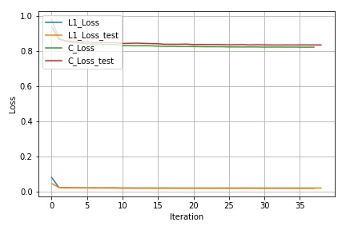
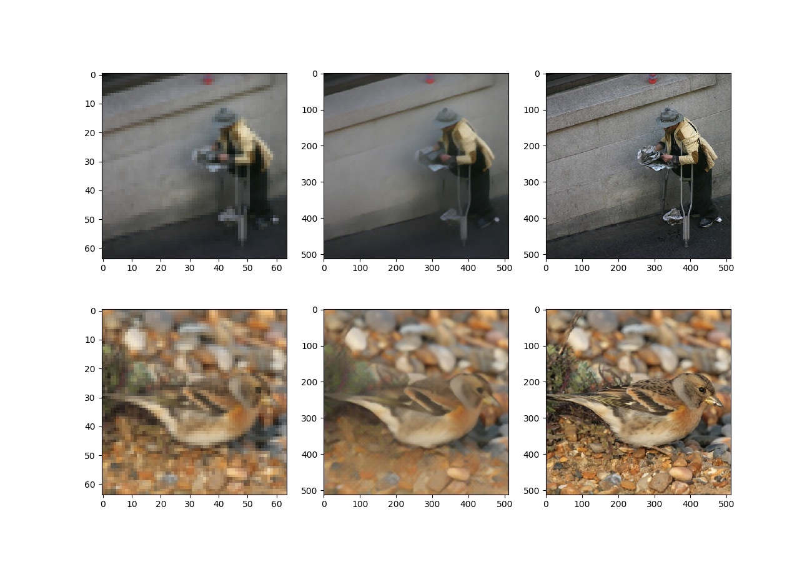

## Getting Started
- Install `pytorch 0.4.0` and dependencies from https://pytorch.org/
- Install packages `tqdm`, `cv2`, `matplotlib`, `tar`, `torchvision`

- Clone this repo:
```bash
https://github.com/NeuralVFX/super-resolution.git
cd super-resolution
```
- Download the dataset (e.g. [Imagenet or Imagenet Subset](http://pjreddie.com/media/files/VOCtrainval_06-Nov-2007.tar)):
```bash
bash data/get_test_dataset.sh
```

## Train The Model
```bash
python train.py --dataset imagenet --train_epoch 100  --save_root imagenet_upres
```

## Continue Training Existing Saved State
```bash
python train.py --dataset imagenet --train_epoch 100  --save_root imagenet_upres  --load_state output/imagenet_upres_3.json
```

## Command Line Arguments
```
--dataset, default='imagenet', type=str                        # Dataset folder name
--batch_size, default=4, type=int                              # Training batch size
--gen_filters, default=128, type=int                           # Filter count for generator
--vgg_layers_c', default=[3, 8, 15], type=int                  # Layers of VGG to use for content
--l1_weight, default=.1, type=float                            # Multiplier for L1loss
--content_weight, default=.5, type=float                       # Multiplier for content loss
--blur_kernel, default=4, type=int                             # Blur size after downres for the low-res image, helps reduce unrealistic pixelation
--lr, default=1e-3, type=float                                 # Learning rate
--lr_drop_start, default=4, type=int                           # Epoch on which the learning rate will begin to drop
--lr_drop_every, default=4, type=int                           # How many epochs between every learning rate drop, learning rate will cut in half each time
--zoom_count, default=3, type=int                              # Zoom factor for upres
--rnn_switch_count, default=4, type=int                        # Before this epoch, upres will be run as RNN, after the trained weights will be copied for fine tuning
--train_epoch, default=60, type=int                            # Number epochs to train for
--in_res, default=64, type=int                                 # Low Res image training size (Images is resized to this value in dataloaders)
--data_perc, default=1.0, type=float                           # Train on a subset of the training set, if set to 1 uses whole dataset
--test_perc, default=.1, type=float                            # Create test set from subset of images
--beta1, default=.5, type=float                                # Beta1 value used by optimizer
--beta2, default=.999, type=float                              # Beta2 value used by optimizer
--ids, default=[1,2,3,4], type=int                             # Ids which will be indexed into to generate preview images from the validation set
--save_every, default=5, type=int                              # How many epochs between each model save
--save_img_every, default=1, type=int                          # How many epochs between saving image
--save_root, default='imagenet_upres', type=str                # Prefix for files created by the model under the /output directory
--load_state, type=str                                         # Optional: filename of state to load and resume training from
```

## Data Folder Structure

- Dataset:

`data/<data set>/`

Train Dir:

`data/imagenet/`

## Output Folder Structure

- `weights`, `test images` and `loss graph`, are all output to this directory: `output/<save_root>_*.*`

- Loss Graph Example: `output/imagenet_upres_loss.jpg`



- Test Image Example (output every loop through dataset): `output/imagenet_upres_val_40.jpg`



## Other Notes

- Define a test set by setting `--test_perc` to any value above zero

- Use a small subset of the overall training by setting `--data_perc` to any value below one

